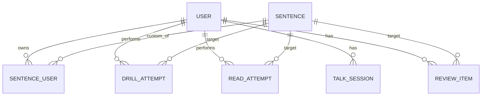

# 设计稿 01 — 架构、数据模型、AI 集成

## 1. 技术栈

| 层 | 选型 | 理由 |
|---|---|---|
| 前端框架 | **Next.js 15 (App Router) + TypeScript** | Server Components 减少客户端 JS；Server Actions 取代 REST API；自带文件路由 |
| UI | **Tailwind CSS 4 + shadcn/ui** | shadcn 不是依赖而是 copy-paste 组件，可自由改造；Tailwind 4 已稳定 |
| 字体 | Noto Sans JP + Noto Serif JP + Inter + JetBrains Mono | 见 [02-UI-UX.md](./02-UI-UX.md) §字体 |
| 状态管理 | **Zustand + React Query (TanStack Query)** | Zustand 管 UI 状态（Display 设置等），React Query 管服务端数据缓存。无 Redux 这种重器。 |
| 表单 | **react-hook-form + Zod** | drill 输入校验、设置面板表单 |
| 后端 | **Next.js Route Handlers + Server Actions** | drill 评估、TTS 缓存、对话流式响应都在 Next.js 内 |
| 数据库 | **SQLite + better-sqlite3** | 文件级零服务，单用户本地最快。`./data/app.db` |
| ORM | **Drizzle** | 比 Prisma 轻、SQL 透明、类型完美；SQLite/Postgres 都支持 |
| 文件存储 | **本地文件系统**（`./data/audio/` 和 `./data/tts/`） | 录音 + TTS 缓存都落本地，零服务依赖 |
| 鉴权 | **无**（绑 localhost 单用户） | 个人项目，部署也只跑在 127.0.0.1 |
| AI | **Gemini 2.5 Flash**（聊天/评估）+ **Google Cloud STT/TTS**（语音） | 仍需联网；key 放 `.env.local` |
| 录音 | **MediaRecorder API + opus/webm** | 浏览器原生，体积小，Chrome/Safari 都支持 |
| PWA | **Serwist**（next-pwa 继承者） | Service Worker + manifest |
| 部署 | **本地运行** `pnpm dev` / `pnpm start`；想远程访问可选 Vercel 或 Cloudflare Tunnel | 个人项目首选 localhost |
| 监控 | **Vercel Analytics**（轻量） | 个人项目不需要 Datadog |
| Lint / Format | **Biome**（替代 ESLint + Prettier） | 单工具、Rust 写的快 |
| 测试 | **Vitest + Playwright**（关键路径） | 单元测试 drill 评估和 SM-2；E2E 测试录音流程 |

### 拒绝的技术
- **NestJS** — 单用户项目 overkill
- **Prisma** — 比 Drizzle 重、查询计划不透明
- **Redux** — Zustand 一个就够
- **CSS-in-JS（styled-components 等）** — Tailwind 已经覆盖
- **Storybook** — 个人项目，自己用就直接看页面，组件库 review 用 shadcn 已有的展示就够

## 2. 项目结构

```
japanese/
├── app/
│   ├── (auth)/
│   │   └── login/page.tsx          # magic link 登录
│   ├── (app)/                       # 登录后的主要路由
│   │   ├── layout.tsx               # 含全局导航
│   │   ├── page.tsx                 # Dashboard
│   │   ├── display/page.tsx         # 轮播屏（特殊：无 chrome）
│   │   ├── drill/page.tsx           # 写作 drill
│   │   ├── read/page.tsx            # 跟读
│   │   ├── talk/page.tsx            # 对话
│   │   └── library/
│   │       ├── page.tsx             # 场景库列表
│   │       └── notebook/page.tsx    # 个人语料本
│   ├── api/
│   │   ├── tts/route.ts             # TTS 代理 + 缓存
│   │   ├── stt/route.ts             # STT 代理
│   │   ├── drill/evaluate/route.ts  # Gemini drill 评估
│   │   ├── talk/stream/route.ts     # 对话流式
│   │   └── notebook/extract/route.ts # 从文本抽取语料
│   └── layout.tsx                   # 根布局
├── components/
│   ├── ui/                          # shadcn 组件
│   ├── sentence-card.tsx            # 日文句子展示（含 furigana）
│   ├── record-button.tsx
│   ├── chat-bubble.tsx
│   └── display-ticker.tsx           # Display 模式核心组件
├── lib/
│   ├── db/
│   │   ├── schema.ts                # Drizzle schema
│   │   └── client.ts
│   ├── ai/
│   │   ├── gemini.ts                # Gemini 客户端 + prompt
│   │   ├── stt.ts                   # Google STT 封装
│   │   └── tts.ts                   # Google TTS + 缓存
│   ├── sm2.ts                       # 间隔重复算法
│   ├── wer.ts                       # word error rate 计算
│   └── japanese.ts                  # 假名/汉字工具、ruby 标注
├── store/                           # Zustand stores
│   ├── display-settings.ts
│   └── session.ts
├── public/
│   ├── manifest.json                # PWA
│   └── service-worker.js
├── docs/
│   ├── 00-DESIGN.md
│   ├── 01-ARCHITECTURE.md           # 本文件
│   └── 02-UI-UX.md
├── drizzle/                         # migrations
├── seed/
│   └── scenarios.ts                 # 200 句预置场景
└── tests/
```

## 3. 数据模型

> 6 张表。能少则少。

### 3.1 ER 概览（Mermaid）



### 3.2 表定义（Drizzle TypeScript schema）

```ts
// lib/db/schema.ts (示意，真实文件按需细化字段长度/索引)

import { pgTable, uuid, text, integer, timestamp, jsonb, real, boolean, index } from 'drizzle-orm/pg-core'

// === 用户（Supabase Auth 已经管了 auth.users；这里只放 profile） ===
export const profile = pgTable('profile', {
  userId: uuid('user_id').primaryKey(),              // 引用 auth.users.id
  displayName: text('display_name'),
  level: text('level').default('N2'),                // self-reported
  streakDays: integer('streak_days').default(0),
  lastActiveAt: timestamp('last_active_at'),
  createdAt: timestamp('created_at').defaultNow(),
})

// === 句子（系统预置 + 用户自建合并存这一张） ===
export const sentence = pgTable('sentence', {
  id: uuid('id').primaryKey().defaultRandom(),
  japanese: text('japanese').notNull(),
  kana: text('kana'),                                // 假名读音（可空，可由 Gemini 自动生成）
  chinese: text('chinese').notNull(),
  category: text('category').notNull(),              // 'rescue' | 'progress' | 'request' | 'apology' | 'smalltalk' | 'custom'
  difficulty: integer('difficulty').default(3),      // 1-5
  source: text('source').default('preset'),          // 'preset' | 'user-import' | 'user-manual'
  ownerId: uuid('owner_id'),                         // NULL = 系统预置；非空 = 用户私有
  tags: jsonb('tags').$type<string[]>().default([]),
  ttsAudioUrl: text('tts_audio_url'),                // 永久缓存（Supabase Storage URL）
  createdAt: timestamp('created_at').defaultNow(),
}, (t) => ({
  ownerIdx: index('sentence_owner_idx').on(t.ownerId),
  categoryIdx: index('sentence_category_idx').on(t.category),
}))

// === 写作 drill 尝试 ===
export const drillAttempt = pgTable('drill_attempt', {
  id: uuid('id').primaryKey().defaultRandom(),
  userId: uuid('user_id').notNull(),
  sentenceId: uuid('sentence_id').notNull(),         // 中文 prompt 的来源句子
  userInput: text('user_input').notNull(),
  geminiNaturalScore: integer('gemini_natural_score'), // 0-100，AI 给的自然度
  geminiNaturalVersion: text('gemini_natural_version'),
  geminiBusinessVersion: text('gemini_business_version'),
  geminiCasualVersion: text('gemini_casual_version'),
  geminiExplanation: text('gemini_explanation'),
  createdAt: timestamp('created_at').defaultNow(),
}, (t) => ({
  userCreatedIdx: index('drill_user_created_idx').on(t.userId, t.createdAt),
}))

// === 跟读尝试 ===
export const readAttempt = pgTable('read_attempt', {
  id: uuid('id').primaryKey().defaultRandom(),
  userId: uuid('user_id').notNull(),
  sentenceId: uuid('sentence_id').notNull(),
  audioUrl: text('audio_url'),                       // Supabase Storage（可选保留）
  sttTranscript: text('stt_transcript'),
  sttConfidence: real('stt_confidence'),
  werScore: real('wer_score'),                       // word error rate, 0=完美
  geminiNaturalness: text('gemini_naturalness'),     // 自然度文本评语
  durationMs: integer('duration_ms'),
  createdAt: timestamp('created_at').defaultNow(),
}, (t) => ({
  userCreatedIdx: index('read_user_created_idx').on(t.userId, t.createdAt),
}))

// === 对话会话 ===
export const talkSession = pgTable('talk_session', {
  id: uuid('id').primaryKey().defaultRandom(),
  userId: uuid('user_id').notNull(),
  scenario: text('scenario').notNull(),              // 'progress-report' | 'request-help' | ...
  turns: jsonb('turns').$type<TalkTurn[]>().notNull().default([]),
  summary: text('summary'),                          // Gemini 结束后总结
  createdAt: timestamp('created_at').defaultNow(),
  endedAt: timestamp('ended_at'),
})

type TalkTurn = {
  role: 'ai' | 'user'
  text: string
  audioUrl?: string                                  // 用户音频
  sttTranscript?: string                             // 用户语音转文字
  improvedVersion?: string                           // AI 改写的更自然版
}

// === 复习队列（SM-2） ===
export const reviewItem = pgTable('review_item', {
  id: uuid('id').primaryKey().defaultRandom(),
  userId: uuid('user_id').notNull(),
  sentenceId: uuid('sentence_id').notNull(),
  reason: text('reason').notNull(),                  // 'drill-failed' | 'read-failed' | 'user-saved' | 'auto-from-notebook'
  // SM-2 字段
  easeFactor: real('ease_factor').default(2.5),
  intervalDays: integer('interval_days').default(0),
  repetitions: integer('repetitions').default(0),
  nextReviewAt: timestamp('next_review_at').notNull(),
  lastReviewAt: timestamp('last_review_at'),
  createdAt: timestamp('created_at').defaultNow(),
}, (t) => ({
  userDueIdx: index('review_user_due_idx').on(t.userId, t.nextReviewAt),
}))
```

### 3.3 单用户简化

本地 SQLite 单用户，**不需要 user_id 字段**。所有表删掉 `userId` / `ownerId` 列，省一大堆 join 和 where 条件。

Drizzle SQLite dialect（用 `pgTable` 改成 `sqliteTable`，类型用 `integer` / `text` / `real`；时间用 `integer({ mode: 'timestamp' })`）。

> 如果未来加多设备同步（v2），最简单做法：把 SQLite 文件托管到 Litestream/iCloud，仍然不需要服务端。

## 4. AI 集成详细设计

### 4.1 Gemini Prompt 设计

> 所有 prompt 用 system + user 双段结构。所有响应强制返回 JSON。

#### Prompt 1：写作 drill 评估

```
SYSTEM:
你是一位日企工作 10 年以上的中国人前辈。任务：评估学习者把中文翻成日语的尝试。
学习者背景：N1 阅读能力，能看懂但不擅长输出。在日企工作。

输出严格的 JSON：
{
  "naturalScore": 0-100,           // 自然度评分
  "issues": ["..."],               // 问题列表，每条不超过 20 字
  "natural": "...",                // 最自然的版本（口语和书面之间的中道）
  "business": "...",               // 商务正式版本（敬语、缓冲）
  "casual": "...",                 // 同事间口语版本
  "explanation": "..."             // 中文解释，<= 100 字
}

只输出 JSON，不要 markdown 代码块。

USER:
原中文：{chinese}
学习者尝试：{user_input}
```

#### Prompt 2：对话续接

```
SYSTEM:
你是日企的{scenario_role}（如：上司 / 同僚 / 隣のチーム）。
和学习者用日语对话。你的目标：自然推进，但偶尔故意用一些他可能不熟的商务表达，让他被动学习。
学习者背景：N1 阅读，开口练习中，可能会卡壳或用奇怪表达。

规则：
- 每次只回一句日语，最多 30 字。
- 用 plain text，不要解释，不要中文。
- 如果学习者说错了或不自然，**不要在对话中纠正**——继续推进，让他先把对话走完。
- 如果学习者明显卡壳（输出包含"えーと" / "ちょっと…" / 等），换更简单的问法或主动接话。

USER:
对话历史：
{turn_history}

学习者刚刚说：{user_last}

你的下一句：
```

对话结束时单独调一次：

```
SYSTEM:
你刚和学习者完成了一轮{scenario}场景的日语对话。任务：写一份简短复盘。

输出 JSON：
{
  "summary": "...",        // <= 50 字，总体表现
  "highlights": ["..."],   // 1-3 条用得好的地方
  "improvements": [        // 学习者每句的改写建议（仅对需要的句子）
    {
      "userOriginal": "...",
      "suggested": "...",
      "reason": "..."
    }
  ],
  "newSentencesForReview": ["..."]  // 推荐加入复习队列的关键句
}

USER:
对话历史：
{full_transcript}
```

#### Prompt 3：语料抽取（notebook import）

```
SYSTEM:
任务：从用户粘贴的文本（可能是会议纪要、Slack 对话、邮件）中抽取**实用的日语短句**。

规则：
- 只抽日语句子或短语，不抽单个词。
- 每条 5-30 字。
- 跳过寒暄、纯礼貌套话（如"よろしくお願いします"单独出现）。
- 如果原文有中文上下文，用它来推断翻译；否则翻译成中文。
- 输出 JSON 数组，每条：
  {
    "japanese": "...",
    "chinese": "...",
    "category": "rescue|progress|request|apology|smalltalk|other",
    "tags": ["..."]  // 关键词标签
  }
- 最多返回 20 条。按"实用性"排序（高频商务表达优先）。

USER:
{user_pasted_text}
```

### 4.2 TTS 缓存策略

```typescript
// lib/ai/tts.ts 核心逻辑
import { createHash } from 'node:crypto'

async function getTTS(text: string): Promise<string> {
  const hash = createHash('sha256').update(text + 'ja-JP|female|standard').digest('hex')
  const path = `tts/${hash}.mp3`

  // 1. 查 Supabase Storage
  const existing = await storage.from('tts').list('', { search: `${hash}.mp3` })
  if (existing.data?.length) {
    return storage.from('tts').getPublicUrl(path).data.publicUrl
  }

  // 2. 不存在 → 调 Google TTS → 上传
  const audio = await googleTTS.synthesize({ text, languageCode: 'ja-JP', voice: 'ja-JP-Neural2-B' })
  await storage.from('tts').upload(path, audio, { contentType: 'audio/mpeg' })
  return storage.from('tts').getPublicUrl(path).data.publicUrl
}
```

**核心约束**：sentence 表的 `tts_audio_url` 字段在首次合成后写入。后续直接读 URL，永不走 Google TTS。

### 4.3 STT 双模式

| 模式 | 用途 | 实现 |
|---|---|---|
| **快速**（默认） | Display 模式跟读、随手练习 | Web Speech API（浏览器原生，免费，离线） |
| **精确** | 跟读评分、对话会话 | 上传到 `/api/stt` → Google Speech-to-Text v2 |

`/api/stt`：
- 接收 webm/opus 音频（已是 Chrome MediaRecorder 默认输出）
- 直接转发到 Google STT，model: `latest_long`、language: `ja-JP`、enable_word_confidence: true
- 返回 transcript + per-word confidence
- 然后客户端用 `lib/wer.ts` 计算 WER 给出粗发音分

### 4.4 WER 计算

```typescript
// lib/wer.ts
// 把日文按"形态素"切分太重，V1 直接按字符（包括汉字单字）计算 Levenshtein 距离
// 这对中国学习者足够：他们常错"促音漏掉" / "长音漏掉" / "拗音错" 都是字符级 diff 能抓的

export function wer(target: string, recognized: string): number {
  const t = Array.from(target.replace(/[\s、。，,.]/g, ''))
  const r = Array.from(recognized.replace(/[\s、。，,.]/g, ''))
  return levenshtein(t, r) / Math.max(t.length, 1)
}
```

V2 可换成 kuromoji.js 做词级切分。

## 5. 录音流程

```
[Mic icon clicked]
    ↓
navigator.mediaDevices.getUserMedia({ audio: true })
    ↓
new MediaRecorder(stream, { mimeType: 'audio/webm;codecs=opus' })
    ↓
[Recording] (visualize via AudioContext + AnalyserNode, draw waveform on canvas)
    ↓
[User clicks stop OR 10s timeout]
    ↓
Blob (audio/webm) → upload to /api/stt (multipart)
    ↓
[Server] Google STT v2 → transcript + confidence
    ↓
[Client] Compute WER vs target
    ↓
Display result + send drill_attempt or read_attempt to DB
```

录音文件**默认不保存到 Storage**。只有用户主动点"加入复习 + 保留录音"才上传。

## 6. PWA 配置

```json
// public/manifest.json
{
  "name": "Nihongo Studio",
  "short_name": "日语训练",
  "start_url": "/",
  "display": "standalone",
  "background_color": "#0B1020",
  "theme_color": "#0B1020",
  "orientation": "any",
  "icons": [
    { "src": "/icons/192.png", "sizes": "192x192", "type": "image/png" },
    { "src": "/icons/512.png", "sizes": "512x512", "type": "image/png" }
  ],
  "categories": ["education", "productivity"]
}
```

Display 路由特殊处理：
- 添加 `<meta name="theme-color" content="#0B1020">`
- 启用 wake lock API（`navigator.wakeLock.request('screen')`）防止 Display 模式下手机锁屏

## 7. 性能与容量预期

| 指标 | 目标 |
|---|---|
| FCP | < 1.5s（Vercel CDN + Next.js streaming） |
| TTI | < 2.5s |
| Display 模式 60fps | 必须（CSS transform / opacity 动画，避免 layout） |
| 录音延迟 | <= 200ms 启动 |
| Gemini drill 评估 | p50 < 3s, p95 < 8s |
| TTS 首次合成 | p50 < 2s |
| TTS 缓存命中 | p50 < 100ms（直接 CDN） |
| 月 Supabase 免费 tier 占用 | < 30% |
| 月 Gemini 费用 | < $5 |

## 8. 关键风险与缓解

| 风险 | 影响 | 缓解 |
|---|---|---|
| Gemini 偶尔返回非 JSON | Drill 评估失败 | 用 zod schema 校验，失败时重试 1 次 + 兜底返回 "暂时无法评估" |
| Google STT 对工作场景术语识别差 | WER 评分偏高 | V1 接受；V2 用 SpeechAdaptation 加入用户词表 |
| 浏览器录音权限被拒 | 跟读 / 对话不可用 | 引导文案 + 降级到"输入文本" |
| 长时间 Display 模式手机过热 | 用户停用 | 默认 5 分钟无交互自动降亮度 / 减慢轮播 |
| Supabase 免费 tier 超额 | 服务中断 | 加监控；TTS 缓存满 80% 时清理最旧 30% |

## 9. 下一份

[02-UI-UX.md](./02-UI-UX.md) — 设计系统 + 各页面 mockup
